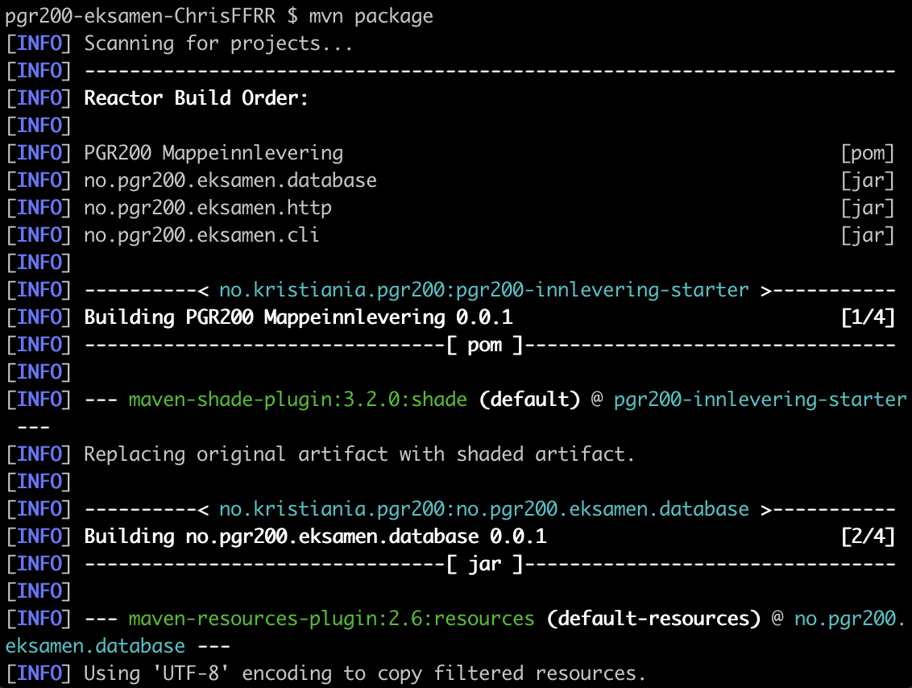
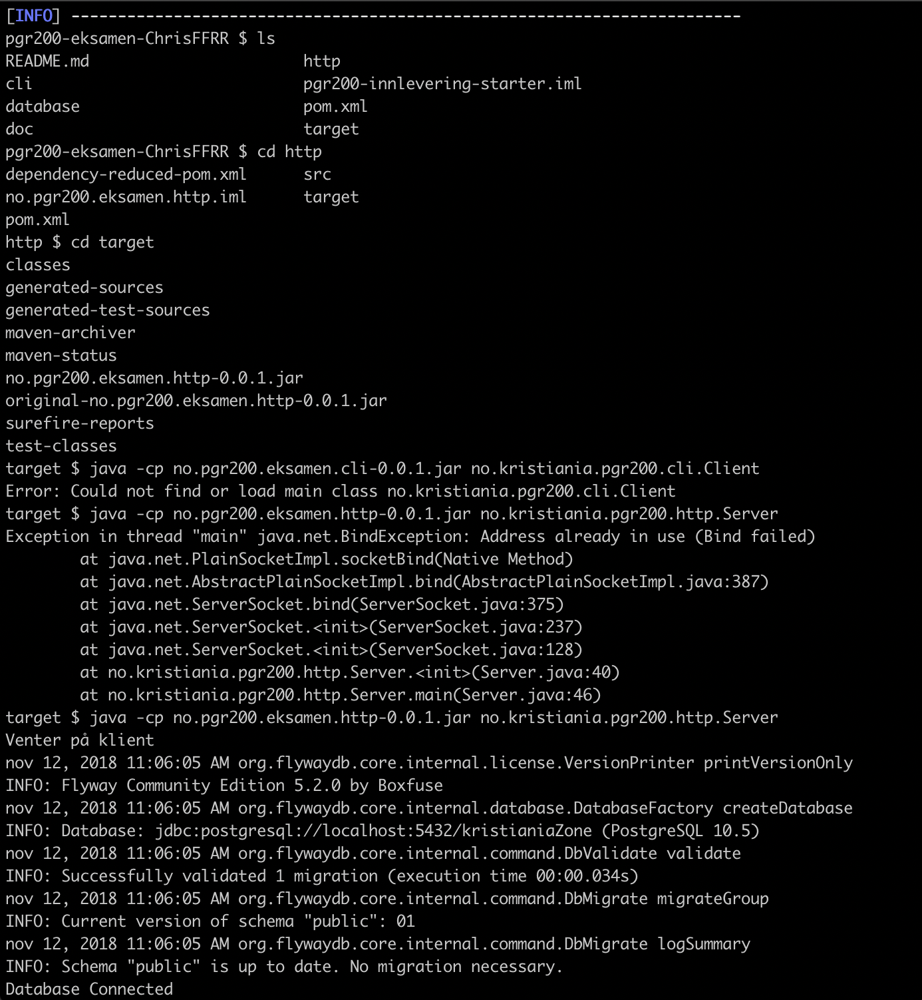
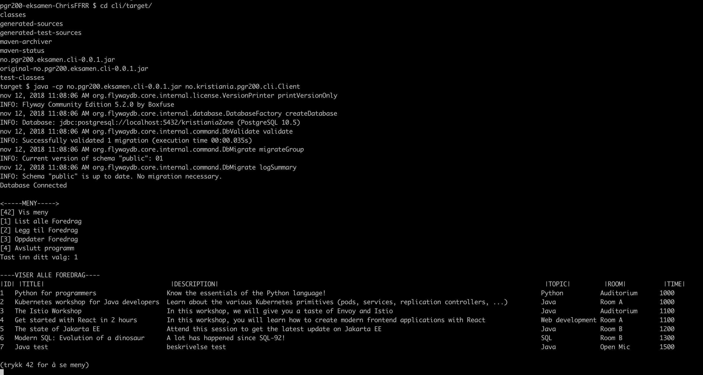
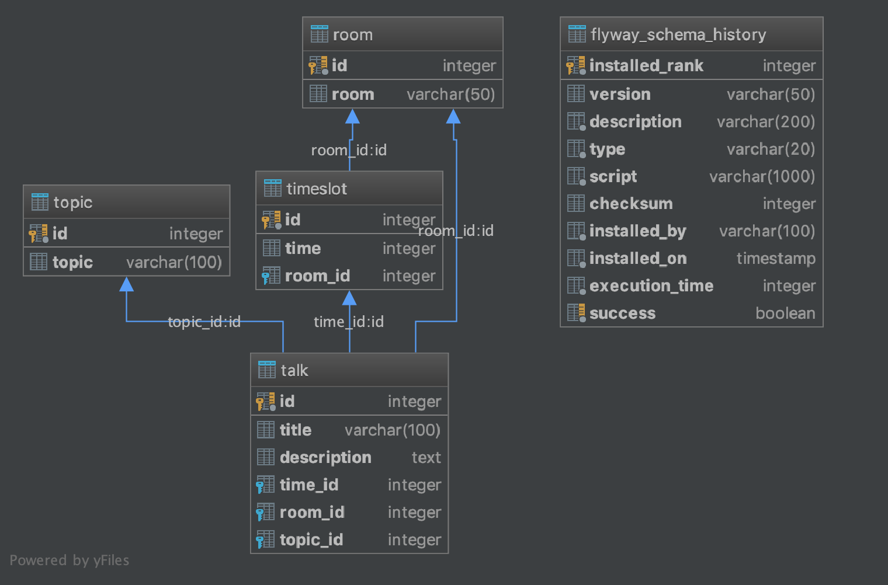

# PGR200 Hovedinnlevering 
Laget av: Mikael Peter Svanåsbakken & Christopher Marchand

#Hva var oppgaven vi skulle løse?
"Du har funnet en konferanse du er interessert i å gå på, men du har ikke råd til billetten. Men frykt ikke: etter at du tok kontakt med de som organiserer konferansen fikk du høre at du kunne få gratisbillett dersom du hjelper til å lage noe programvare for konferansen.

Oppgaven din: lag en server for appen som inneholder konferanseprogrammet i en database. Funksjonaliteten må som et minimum tillate at man legger inn og lister ut foredrag på konferansen. Du bruke datamodellen angitt under eller forenkle eller endre den slik du selv ønsker.

Programmet skal følge god programmeringsskikk: Det skal ha enhetstester, det skal ha en god README-dokumentasjon, det skal hente inn konfigurasjon fra en .properties-fil. Fila skal ligge i current working directory, hete innlevering.properties og inneholde properties dataSource.url, dataSource.username og dataSource.password. Når vi evaluerer oppgaven ønsker vi å bruke egne verdier for disse. Prosjektet bør også bygge automatisk på Travis CI.

Pass på at det er godt med tester, at koden kompilerer og kjører ok med "mvn test" og at du beskriver hvordan man tester løsningen manuelt."

# Hvordan kjøre programmet

* OBS innlevering.properties ligger i pgr200-eksamen-ChrisFFRR/database/src/main/resources/innlevering.properties
  
  * åpne terminal og naviger til prosjektmappe
  * kjør mvn clean install i prosjektfolder 
  * kjør mvn package 
  * naviger til http/target mappen
  * skriv inn java -cp no.pgr200.eksamen.http-0.0.1.jar no.kristiania.pgr200.http.Server
  * åpne nytt terminal/cmd vindu
  * naviger til cli/target mappe
  * skriv inn java -cp no.pgr200.eksamen.cli-0.0.1.jar no.kristiania.pgr200.cli.Client
  * OBS!  terminal vinduet du kjører clienten fra bør være fullscreen for å få riktig formattering av foredrag.
  
  * IDE
  * Kjør /pgr200-eksamen-ChrisFFRR/http/src/main/java/no/kristiania/pgr200/http/Server.java
  * Kjør /pgr200-eksamen-ChrisFFRR/cli/src/main/java/no/kristiania/pgr200/cli/Client.java
  
  * Følg meny-valg i client terminal vindu. 
  
 

# Link til screencast av Ping Pong programmering
1: https://youtu.be/DSzJ1lX7BPY 2: https://youtu.be/BMf13V9nuLU

# Egenvurdering.
Oppgaven gikk ut på at vi inserte/oppdatere/endre informasjon inn i en Database ved hjelp av å bruke post/get/put requests. 
Vi begge synes oppgaven har godt greit og vi synes av i jobber bra sammen. Vi jobbet en del sammen på skolen og når vi ikke         var på skolen jobbet vi som i forrige innlevering via Discord, da delte vi skjermen og diskuterte koden ilag. Denne oppgaven hadde større scope som førte til at vi kunne jobbe på flere klasser samtidig. Som skapte en workflow i prosjektet våres.
  
Det gikk mye tid på å løse småfeil i koden når kodebasen vokste og da fikk vi lærdom i det at det enkleste er ikke alltid det beste siden vi fort kunne ende opp i å ha "tech debt", siden den enkle løsningen tidligere skapte problemer senere prosjektet hvis vi ville utvide funksjonaliteten. Blant problemene vi har slitet litt med er for eksempel det at Clienten våres støtter ikke ÆØÅ, den skjønner ikke disse bokstavene selvom vi har prøvet å få alt til å kjøre via UTF-8 unicode standarden. Derfor velger vi å spesifisere at de som bruker programmet må unngå disse tegnene.

Vi sammen bestemte oss får å bruke våres personlige CLI som vi lagde i forrige innlevering, og utvide den lit for ny funksjonalitet, den er veldig enkel og kunne f.eks bruke SWITCH isteden for IF/ELSE/WHILE men vi hadde litt dårlig tid så det er en del forbedringer vi er klar over som vi kunne ha implementert om tiden strakk til. Blant ideène våres var å faktisk flytte databasen opp til Azure MySQL database, det lå en guide på dette på microsoft sine sider og vi tror dette hadde vært en ganske enkel løsning men tiden som sagt strakk ikke helt til.

Vi synes vi har jobbet kvikt og effektivt. Vi har ett rimelig nivå Enhetstester for databasedelen, kjører på Travis CI, kode uten større skrivefeil eller feil innrykk, vi har også sikret oss mot SQL injections og vi har en god readme som beskriver steg for å demonstrere programmet. Koden våres er enkel å lese, konsis og utrykksfull. Vi føler vi har jobbet veldig hardt på dette så vi synes at vi har ihvertfall oppnådd graden C. Vi skulle gjerne ønske at vi kunne få en B men vi føler kanskje at det er noen mangler som gjør at vi ikke strekker helt til - men dette er opp til de som vurderer innleveringen våres.

Vi vil gjerne gjøre de som vurderer denne innleveringen oppmerksom på at vi har ingen dedikert SHOW funksjonalitet siden vi følte at det ikke var nødvendig siden Klienten viser alt til deg uansett hva du gjør, så det er ingen passelig plass å vise dette. Vi har en "list all talks" som fullfører dette.
  
  
  
- Problemer med ÆØÅ & UTF-8
- Noe funksjonalitet som ikke er implementert.
- Lagde våres egen CLI.
- Planen var å flytte det opp i Azure men hadde ikke tid.
- Jobbet bra, klarte å splitte arbeidet opp mer enn forrige innlevering.
- Jobbet via Discord, og møtte opp på skolen.

